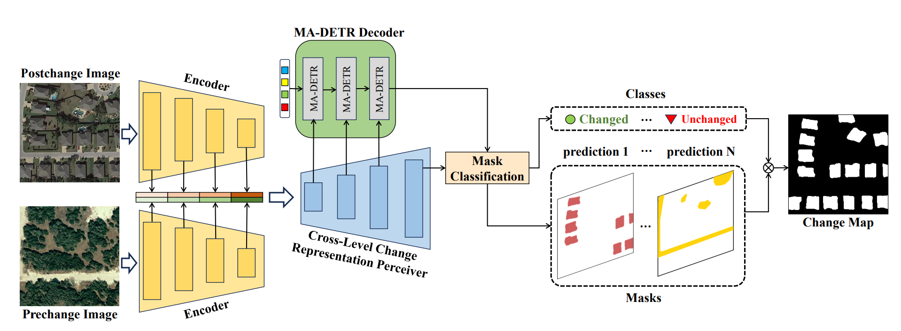
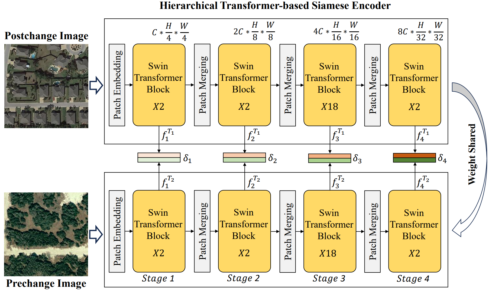
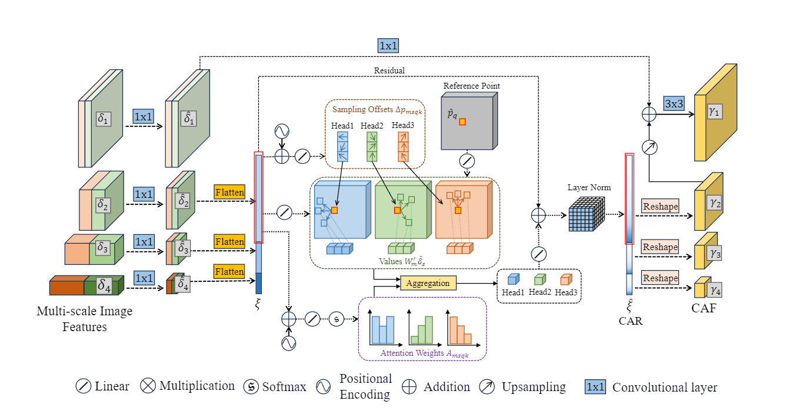
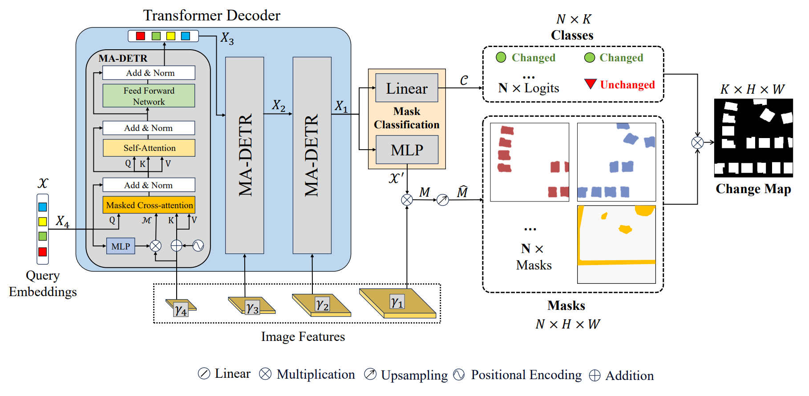

<div align="center">
<h1>MaskCD </h1>
<h3>MaskCD: A Remote Sensing Change Detection Network Based on Mask Classification</h3>

[Weikang Yu](https://ericyu97.github.io/)<sup>1,2</sup>, [Xiaokang Zhang](https://xkzhang.info/)<sup>3</sup>, [Samiran Das](https://scholar.google.co.in/citations?user=1p3HJ-cAAAAJ&hl=en)<sup>4</sup>, [Xiao Xiang Zhu](https://www.asg.ed.tum.de/sipeo/home/)<sup>1</sup>, [Pedram Ghamisi](https://www.ai4rs.com/)<sup>2,5</sup>

<sup>1</sup> Technical University of Munich, <sup>2</sup> Helmholtz-Zentrum Dresden-Rossendorf (HZDR), <sup>3</sup> Wuhan University of Science and Technology, <sup>4</sup> Indian Institute of Science Education and Research, <sup>5</sup> Lancaster University

Paper: [IEEE TGRS 2024](https://ieeexplore.ieee.org/document/10587034) (DOI: 10.1109/TGRS.2024.3424300)
</div>


## Updates
``July 5, 2024`` Our paper has been accepted on IEEE TGRS, and the code is released.
## Abstract
Change detection (CD) from remote sensing (RS) images using deep learning has been widely investigated in the literature. It is typically regarded as a pixel-wise labeling task that aims to classify each pixel as changed or unchanged. Although per-pixel classification networks in encoder-decoder structures have shown dominance, they still suffer from imprecise boundaries and incomplete object delineation at various scenes. For high-resolution RS images, partly or totally changed objects are more worthy of attention rather than a single pixel. Therefore, we revisit the CD task from the mask prediction and classification perspective and propose MaskCD to detect changed areas by adaptively generating categorized masks from input image pairs. Specifically, it utilizes a cross-level change representation perceiver (CLCRP) to learn multiscale change-aware representations and capture spatiotemporal relations from encoded features by exploiting deformable multihead self-attention (DeformMHSA). Subsequently, a masked cross-attention-based detection transformers (MCA-DETR) decoder is developed to accurately locate and identify changed objects based on masked cross-attention and self-attention mechanisms. It reconstructs the desired changed objects by decoding the pixel-wise representations into learnable mask proposals and making final predictions from these candidates. Experimental results on five benchmark datasets demonstrate the proposed approach outperforms other state-of-the-art models.
## Overview
* **MaskCD** is a pioneering work introducing the mask classification paradigm into remote sensing change detection.
<p align="center">
  
</p>

* **Hierarchical transformer-based Siamese encoder** uses the window-shifted self-attention mechanism to simultaneously extract bitemporal deep features from remote sensing images.
<p align="center">
  
</p>

* **Cross-Level Change Representation Perceiver** integrates deformable multi-head self-attention mechanism and an FPN to obtain multi-scale binary masks.
<p align="center">
  
</p>

* **Masked Cross-attention-based Decoder and Mask Classification module** processes query embeddings to obtain per-segment embeddings as foundations for generating mask embeddings and the class labels for the masks. 
<p align="center">
  
</p>

## Getting started
### Environment Preparation
Create a conda environment for MaskCD
 ```console
conda create -n maskcd
conda activate maskcd
conda install pytorch torchvision pytorch-cuda=12.1 -c pytorch -c nvidia
pip install transformers==4.35.0
pip install accelerate==0.22.0
pip install datasets==2.19.0
pip install scipy
```
Configurate the accelerate package:
```console
accelerate config
```
___
### Run the Experiments
#### Training a model:
```console
accelerate launch train.py $DATASET_ID$ --batch-size 32 --learning-rate 5e-5 --epochs 100
```
``DATASET_ID`` is the repo_id of the dataset on Huggingface Hub. 

Avalaible examples used in MaskCD: 

``ericyu/CLCD_Cropped_256`` 
``ericyu/LEVIRCD_Cropped_256`` 
``ericyu/SYSU_CD``
``ericyu/GVLM_Cropped_256``
``ericyu/EGY_BCD``

The model will be automatically saved under the path "./exp/\$DATASET_ID\$/", the model with the highest F1 score will be saved under "./exp/``DATASET_ID``/best_f1"
___
Testing a model:
```console
accelerate launch test.py --dataset $DATASET_ID$ --model $MODEL_ID$
```
The ``MODEL_ID`` can be the path of your trained model (e.g., exp/``DATASET_ID``/best_f1)

___
Reproducing our results:

We have uploaded our pretrained model weights to the Huggingface Hub, the ``MODEL_ID`` is as follows:

``ericyu/MaskCD_CLCD_Cropped_256``
``ericyu/MaskCD_LEVIRCD_Cropped256``
``ericyu/MaskCD_SYSU_CD``
``ericyu/MaskCD_GVLM_Cropped_256``
``ericyu/MaskCD_EGY_BCD``

Here is an example pf reproducing the results of MaskCD on CLCD results:
```console
accelerate launch test.py --dataset ericyu/CLCD_Cropped_256 --model ericyu/MaskCD_CLCD_Cropped_256
```
___
Upload your model to Huggingface Hub

You can also push your model to Huggingface Hub by uncommenting and modifying the codeline in the ``test.py``:
```python
if accelerator.is_local_main_process:
    model = model.push_to_hub('ericyu/MaskCD_EGY_BCD')
```

If you find MaskCD useful for your study, please kindly cite us:
```
@ARTICLE{10587034,
  author={Yu, Weikang and Zhang, Xiaokang and Das, Samiran and Zhu, Xiao Xiang and Ghamisi, Pedram},
  journal={IEEE Transactions on Geoscience and Remote Sensing}, 
  title={MaskCD: A Remote Sensing Change Detection Network Based on Mask Classification}, 
  year={2024},
  volume={},
  number={},
  pages={1-1},
  keywords={Mask classification;masked cross-attention;deformable attention;change detection;deep learning;remote Sensing},
  doi={10.1109/TGRS.2024.3424300}}
```

## Future Development Schedule:

We are developing a unified change detection (UCD) framework that implements more than 18 change detection approaches and have more than 70 available models. The codes will be released [here](https://github.com/EricYu97/UCD).

## Tutorial Avaiable!
We just added a very simple example as a tutorial for those who are interested in change detection, check [here](https://github.com/EricYu97/CDTutorial) for more details.

## Acknowledgement:

This codebase is heavily borrowed from [Transformers](https://github.com/huggingface/transformers) package.


